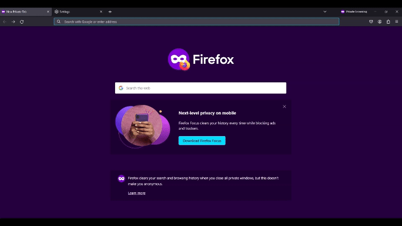

# URL Shortener Microservice

This is a URL shortener microservice implemented in Golang. It allows users to shorten long URLs into shorter ones, which can then be used to redirect to the original long URLs.

## Features

- Shorten long URLs into shorter, more manageable ones.
- Redirect users from short URLs to their corresponding long URLs.

## Deployment

The microservice has been deployed and is live at the following URL:

[https://url-shortener-qozm.onrender.com](https://url-shortener-qozm.onrender.com)

Feel free to test it out and shorten your URLs! Alternatively, you can follow the installation instructions below to use it locally or deploy your own version.

## Installation

1. Clone the repository to your local machine:

    ```bash
    git clone https://github.com/amy324/Go-URL-Shortener-Microservice.git
    ```

2. Navigate to the project directory:

    ```bash
    cd Go-URL-Shortener-Microservice
    ```

3. Install dependencies:

    ```bash
    go mod tidy
    ```

4. Create a `.env` file in the root directory of the project. The file should contain the following environment variables:

    ```plaintext
    REDIS_STRING=your_redis_address:port
    REDIS_PASSWORD=your_redis_password
    ```

    Replace `your_redis_address:port` and `your_redis_password` with your actual Redis server address, port, and password.

## Usage

1. Run the application:

    ```bash
    go run .
    ```

2. The server should now be running on port `8080`.

3. Use the following endpoints to interact with the API:

    - `POST /shorten`: Shortens a long URL. Send a JSON object with the long URL in the request body.
    - `GET /{shortURL}`: Redirects to the original long URL associated with the provided short code.

## Testing

The project includes a test file named `main_test.go` in the root directory. This file contains unit tests for the main functionalities of the URL shortener microservice. To run the tests, use the following command:

```bash
go test
```

The tests ensure that the URL shortening and redirection functionalities work as expected and handle different scenarios correctly.

The outcome of the test should be:
```
$ go test
Connected to Redis
2024/02/16 15:23:16 Shortened URL created: https://example.com -> c984d06a
2024/02/16 15:23:16 Redirect requested for short URL: c984d06a
2024/02/16 15:23:16 Retrieved long URL from Redis for short URL c984d06a: https://example.com
2024/02/16 15:23:16 Redirecting to long URL: https://example.com
PASS
ok      shortener       1.814s
```

## Dependencies

This project relies on the following external dependencies:

- [gorilla/mux](https://github.com/gorilla/mux): A powerful HTTP router and URL matcher for building Go web servers.
- [joho/godotenv](https://github.com/joho/godotenv): A Go package for loading environment variables from a `.env` file.
- [go-redis/redis](https://github.com/go-redis/redis/v9): A Go client library for the Redis key-value store.

## Example Usage

Below is an example of using the deployed program to shorten the search engine URL for [DuckDuckGo](https://duckduckgo.com/):

1. Make a `POST` request to shorten the URL by sending the desired URL in the request body:

```json
{
    "url": "https://duckduckgo.com/"
}
```

2. Ensure the response contains both the original URL and the corresponding shortened URL:

```json
{
    "short_url": "168ce875",
    "long_url": "https://duckduckgo.com/"
}
```

3. Clicking [here](https://url-shortener-qozm.onrender.com/168ce875) or entering the shortened URL `https://url-shortener-qozm.onrender.com/168ce875` into the browser will redirect you to DuckDuckGo.

4. Alternatively, testing on Postman using a `GET` request should generate DuckDuckGo's HTML as its response.

## Demonstration

Here's a GIF demonstrating the above URL redirection process:


```

